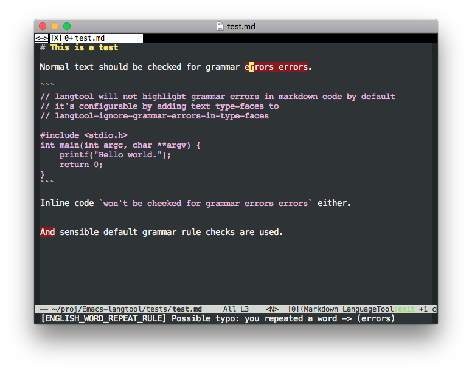

langtool.el
===========


Check for grammar errors using LanguageTool 4.0 and Java 8.

  

`langtool-check` to check for and highlight errors.  
`langtool-correct-buffer`  to fix discovered errors.

Grammar checks are quick by using a long-running LanguageTool HTTPServer in the background.

Credits: Largely based off implementation https://github.com/mhayashi1120/Emacs-langtool .


## Installation - Mac

Install Java 8:

https://java.com/en/download/

Install languagetool:

```
brew install languagetool
```

Place in `.emacs`:

```
(require 'langtool)
(setq langtool-bin "/usr/local/bin/languagetool-server")
(setq langtool-enabled-rules '("And"))
(setq langtool-disabled-rules '("WHITESPACE_RULE" "EN_QUOTES"))
```

## Installation -  Linux (Ubuntu)

Install Java 8

```
sudo add-apt-repository ppa:webupd8team/java
sudo apt-get update
apt-get install oracle-java8-installer oracle-java8-set-default
```

Download LanguageTool:

```
mkdir ~/.langtool
wget 'https://languagetool.org/download/LanguageTool-4.0.zip' -O /tmp/LanguageTool-4.0.zip 
unzip -d ~/.langtool /tmp/LanguageTool-4.0.zip
```

Place in `.emacs`:
```
(require 'langtool)
(setq langtool-language-tool-commandline-jar "~/.langtool/LanguageTool-4.0/languagetool-commandline.jar")
(setq langtool-language-tool-jar "~/.langtool/LanguageTool-4.0/languagetool.jar")
(setq langtool-enabled-rules '("And"))
(setq langtool-disabled-rules '("WHITESPACE_RULE" "EN_QUOTES"))
```

## Installation - Other

Install Java 8

```
https://java.com/en/download/
```

Download and Unzip Language Tool to a directory.

https://languagetool.org/download/LanguageTool-4.0.zip'

Copy below to `.emacs` and update the `langtool-java-classpath` to point to directory containing LanguageTool `.jar` files:

```
(require 'langtool)
(setq langtool-java-classpath
      "/usr/share/languagetool:/usr/share/java/languagetool/*")
(setq langtool-enabled-rules '("And"))
(setq langtool-disabled-rules '("WHITESPACE_RULE" "EN_QUOTES"))
```

## Troubleshooting

* Currently GNU Java version is not working.
  Please change the variable to a Java 8 executable.

```
(setq langtool-java-bin "/path/to/java")
```

## Key Bindings (Optional)

Place in `.emacs`:

```
(global-set-key "\C-x4w" 'langtool-check)
(global-set-key "\C-x4W" 'langtool-check-done)
(global-set-key "\C-x4l" 'langtool-switch-default-language)
(global-set-key "\C-x44" 'langtool-show-message-at-point)
(global-set-key "\C-x4c" 'langtool-correct-buffer)
```


## Configuration

* Default language is detected by LANG/LC_ALL environment variable.
  Please set `langtool-default-language` if you need to change default value.

```
(setq langtool-default-language "en-US")
```

  Otherwise, invoke `M-x langtool-check` with `C-u` (universal-argument)


* Maybe your LanguageTool have launcher. (e.g. Gentoo)
  You need to set `langtool-bin`.
  See https://github.com/mhayashi1120/Emacs-langtool/issues/24

```
(setq langtool-bin "/usr/bin/languagetool")
```

* Maybe you want to specify your mother tongue.

```
(setq langtool-mother-tongue "en")
```

* To customize LanguageTool commandline arguments.

```
(setq langtool-java-user-arguments '("-Dfile.encoding=UTF-8"))
```

  You can also make the variable to buffer local like following:

```
(add-hook '**SOME**-mode-hook
          (lambda () (set (make-local-variable 'langtool-java-user-arguments)
                         '("-Dfile.encoding=UTF-8"))))
```

  NOTE: Although there is no good example, `langtool-user-arguments` is
  a similar custom variable.

## Usage:

* To check current buffer and show warnings.

```
M-x langtool-check
```

  Check with different language. You can complete supported language
  with C-i/TAB

```
C-u M-x langtool-check
```

* To correct marker follow LanguageTool suggestions.

```
M-x langtool-correct-buffer
```

* Go to warning point you can see a report from LanguageTool.
  Otherwise:

```
M-x langtool-show-message-at-point
```

* Show LanguageTool report automatically by `popup`
  This idea come from:
  http://d.hatena.ne.jp/LaclefYoshi/20150912/langtool_popup

```
(defun langtool-autoshow-detail-popup (overlays)
  (when (require 'popup nil t)
    ;; Do not interrupt current popup
    (unless (or popup-instances
                ;; suppress popup after type `C-g` .
                (memq last-command '(keyboard-quit)))
      (let ((msg (langtool-details-error-message overlays)))
        (popup-tip msg)))))
```

```
(setq langtool-autoshow-message-function
      'langtool-autoshow-detail-popup)
```

* To finish checking. All langtool marker is removed.

```
M-x langtool-check-done
```


## More Screenshots

**langtool-correct-buffer**


